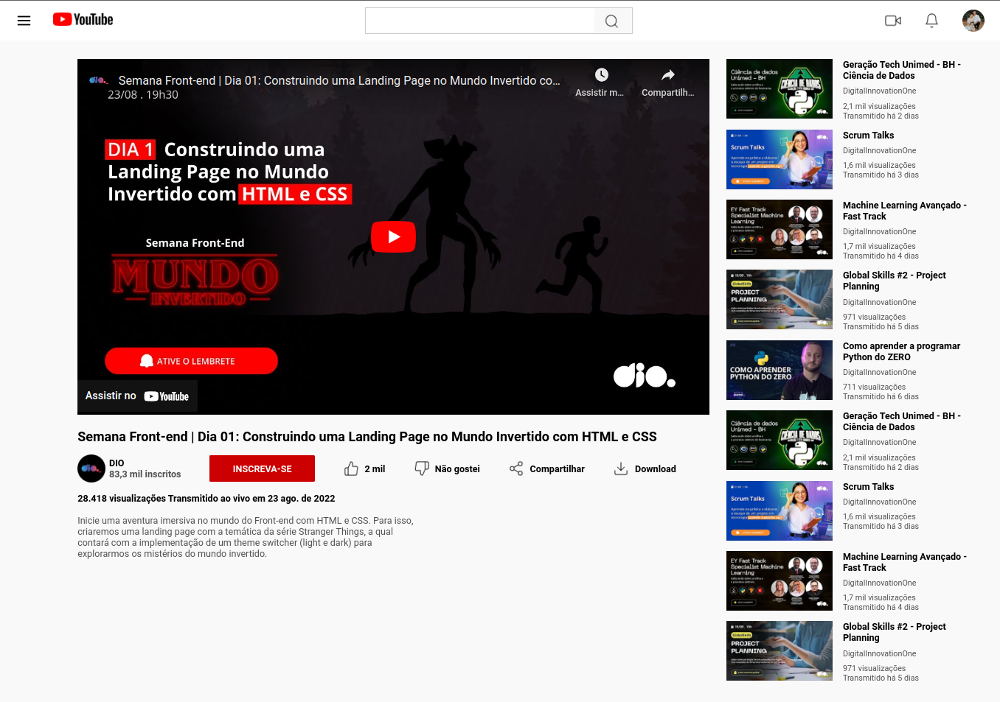

# Desafio 02: Clonando a Página do Youtube com CSS

Projeto desenvolvido para o curso de CSS da [DIO](https://web.dio.me/)

Neste projeto foi desenvolvido um clone da página de vídeo do youtube com HTML e CSS o desafio era desenvolver todo o layout utilizando os conceitos aprendidos nas aulas de CSS, utilizando principalmente flexbox.

[Link do Figma](https://www.figma.com/file/lrRWUZPKnqMDZrSDJmZxUS/Desafio-de-Flexbox---DIO?node-id=0%3A1) usado como protótipo do desafio.

## Resultado final:

